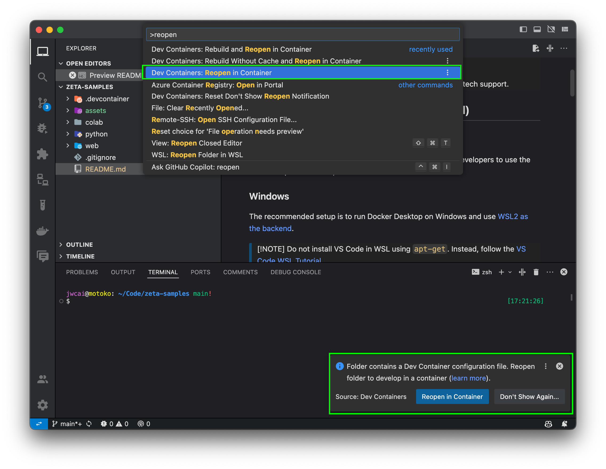

# Cloud Zeta Samples

This is the sample repo for [Cloud Zeta](https://cloudzeta.com), a cloud platform for creators to
manage 3D assets, collaborate on projects, and deliver content from anywhere.

> [!TIP]
>
> Please join our [Discord Server](https://discord.gg/kyTzU2rxYN) for questions, feedback, and tech
> support.

## Setup Development Environment (optional)

<a name="docker"></a>
### Install Docker

Before you begin, make sure [Docker is installed](https://docs.docker.com/get-docker/). This allows
developers to use the same setup on Windows, macOS and Linux.

### Windows

The recommended setup is to run Docker Desktop on Windows and use
[WSL2 as the backend](https://docs.docker.com/desktop/windows/wsl/).

> [!NOTE]
> Do not install VS Code in WSL using `apt-get`. Instead, follow the [VS Code WSL Tutorial](
> https://code.visualstudio.com/docs/remote/wsl-tutorial).
>
> Once done, `code` command in WSL will open the VS Code in Windows.

### macOS

Just follow the official instruction:
[Install Docker Desktop on Mac](https://docs.docker.com/desktop/install/mac-install/). For Apple
silicon, Rosetta 2 is needed to run the X86-based container. To install Rosetta 2 manually from the
command line, run the following command:

```bash
softwareupdate --install-rosetta
```

### Get started with VS Code
```bash
git clone git@github.com:cloud-zeta/zeta-samples.git
code zeta-samples
```

### Open DevContainer



When you open the VS Code workspace for the first time, VS Code will automatically prompt you
to Re-open in the container. VS Code will build the container and setup the environment for you.
You can also use the VS code's `Dev Containers: Reopen in Container` command to manually open the
dev cotnainer.

The first time running this will take some time.

See [Developing inside a Container](https://code.visualstudio.com/docs/devcontainers/containers)
for more context about DevContainers.

## Web SDK Samples

A Typescript SDK that enables developers to embedded 3D content. See [README.md](web/README.md) for
detailed instructions on how to build and integrate.

## Python SDK Samples

First, create your `auth token` in the [user settings page](https://cloudzeta.com/settings).

```bash
python -m venv venv
source venv/bin/activate
pip install cloudzeta-sdk

export ZETA_AUTH_TOKEN_ID="<insert auth toekn ID here...>"
export ZETA_ENCRYPTION_KEY="<insert encryption key here...>"

cd python/01-upload-assets
python main.py
```

> [!NOTE]
>
>   The Python SDK supports Linux for the time being. Let us know your use cases for other
>   platforms in our [#feedback](https://discord.gg/fTm52c2Rfm) discord channel.

## Google Colab Samples

```python
from zeta.sdk.ephemeral import EphemeralStage
from pxr import UsdGeom

s1 = EphemeralStage(api_key="<insert API key here...>")
p1 = UsdGeom.Xform.Define(s1.stage, "/root")
p2 = UsdGeom.Cube.Define(s1.stage, "/root/cube")
s1.preview()
```

You can run the Python SDK directly on Google Colab and preview the result immediately as all the
edits are synced to Cloud Zeta automatically. Available samples and tutorials are:

1. [Hello OpenUSD](./colab/01-hello-openusd.ipynb)
2. Basic OpenUSD (WIP)
3. TBD...

More samples are coming. We also welcome idea suggestions and collaborations on new samples. Join
our [discord](https://discord.gg/kyTzU2rxYN) to chat a chat!

> [!NOTE]
>
> Samples loaded into Cloud Zeta are ephemeral. When previewing those samples, you are accessing
> Cloud Zeta anonymously. Your sample data will be deleted after 24 hours.
>
> If you want to hold on to the assets you created during the tutorials, just create a free-tier
> account [here](https://cloudzeta.com/login).
